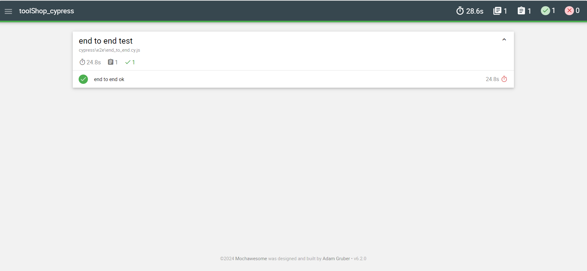

## About TOOLSHOP:
is a software testing application developed by Roy De Kleijn.

## Test Cases:

1. **Registration**
2. **Login**
3. **Logout**
4. **Add Item**
5. **Search Item**
6. **Filter Items**
7. **Checkout**

## Scenarios:

1. **Registration and Login**
2. **Search for item and add it to the cart**
3. **Filter items and add a second item**
4. **Checkout**
5. **Logout**

### Report HTML:

  

### Technology used:
1. Cypress

### Tests execution:
1. Run the tests

        npx cypress open
        npx cypress run

2. Run only one test

        npx cypress run --spec test-file

3. Specify the browser to use

        npx cypress run --browser chrome